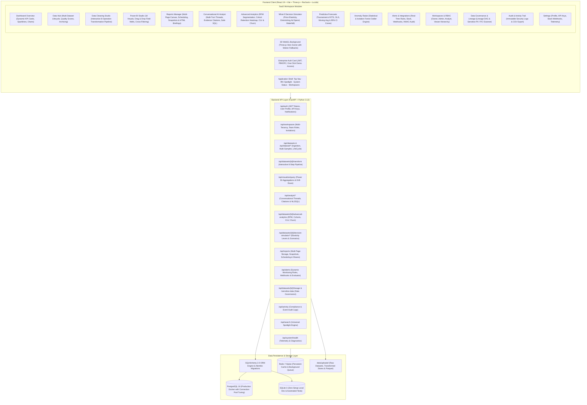
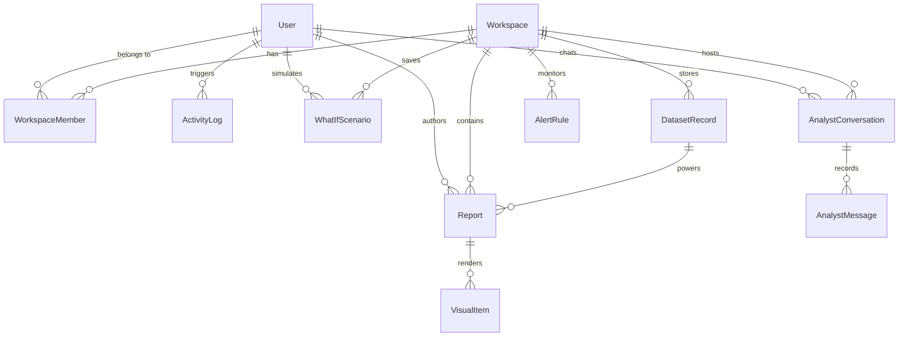

# InsightOps AI — Enterprise AI Business Intelligence & Decision Platform

[-emerald.svg)](tests/)
[](backend/)
[](https://fastapi.tiangolo.com)
[](frontend/)
[](https://threejs.org/)
[](https://www.postgresql.org/)
[](backend/migrations/)
[](.github/workflows/ci.yml)
[](LICENSE)

**InsightOps AI** is a production-grade, enterprise-scale universal live data intelligence and automated decision platform. It transforms any structured CSV, XLSX, or XLS dataset into an interactive SaaS analytics workspace—automatically detecting schemas, cleaning data non-destructively, applying user-driven interactive transformations, computing domain-tailored KPIs, generating 18 responsive Power BI-style visualizations, isolating anomalies, projecting statistical forecasts, running econometric What-If decision simulations, computing RFM & customer lifetime value models, and serving a deterministic AI Analyst without requiring hard-coded business metric assumptions.

---

## 🏛️ System Architecture



---

## 🚀 Key Platform Features

### 1. Premium UI/UX & Enterprise Aesthetics
- **Dark-First Glassmorphism**: Deep obsidian canvas, high-contrast borders, frosted acrylic surfaces, subtle amber/gold glowing accents, and crisp typography.
- **Dynamic Adaptability**: Instant toggle between Dark Obsidian and Daylight Light modes.
- **Responsive Layout**: Fluid grids supporting desktop-first (4 KPI cols), tablet (2 cols), and mobile screens (1 col with 44px touch targets).

### 2. Immersive 3D Experience (Three.js WebGL)
- **Living 3D Data Constellation**: Connected data nodes, undulating particle waves, rotating geometric bounding boxes, and an AI intelligence orb.
- **Performance Guardrails**: Automatic `prefers-reduced-motion` detection and automatic WebGL fallback on small devices (`width < 768px`) to prevent GPU overhead.

### 3. Advanced Growth Analytics & Unit Economics
- **RFM Customer Segmentation**: Calculates Recency (days), Frequency (orders), and Monetary (spend) quintiles (1-5), classifying accounts into 10 industry personas (Champions, Loyal Customers, Potential Loyalists, At Risk, Can't Lose Them, Hibernating, etc.) with actionable retention playbooks.
- **Acquisition Cohort Retention Heatmap**: Tracks month-by-month user cohorts from M+0 to M+6+ with color-coded retention intensity and churn decay curves.
- **Customer Lifetime Value (CLV) & Churn Predictor**: Evaluates historical spend and calculates forward 12-month predictive CLV; sigmoid churn probability scoring flags accounts into High Risk (>70%), Medium Risk (40-70%), and Healthy Low Risk (<40%).
- **Unit Economics & Capital Efficiency**: Computes CAC (Customer Acquisition Cost), LTV:CAC ratio (with industry benchmarks), ROAS (Return on Ad Spend), and CAC Payback Period in months.

### 4. What-If Decision Simulator
- **Parametric Strategic Levers**:
  - Price Adjustment (-30% to +50%)
  - Marketing & Ad Spend (-50% to +100%)
  - Churn Rate Reduction (0% to 50%)
  - Conversion Rate Uplift (-20% to +40%)
  - Econometric Demand Elasticity Models: Inelastic (-0.4), Moderate (-0.95), Elastic (-1.65)
- **Real-Time Outcomes**: Projects simulated Revenue, Gross Profit, and EBITDA Net Operating Profit with variance comparison against baseline.
- **Revenue Attribution Waterfall**: Visual breakdown isolating Price Effect, Demand Elasticity Drag, Paid Acquisition Lift, and Retention Savings.
- **Sensitivity Sweeps**: Interactive sweeps across -20% to +20% for pricing and ad spend.
- **Saved Scenarios Library**: Save, load, compare, and delete simulated scenarios (`WhatIfScenario`).

### 5. Conversational AI Analyst Workspace
- **Multi-Turn Context-Aware Threads**: Persist and organize conversational analysis threads (`/api/analyst/conversations`).
- **Deterministic NL-to-SQL Engine**: Translates natural language questions to sandboxed, read-only SQL executed on in-memory dataset tables.
- **Evidence Citations & Zero Hallucination**: Every answer includes rows scanned, verified metrics, calculation formulas, confidence scores (95%+), and links to source columns.
- **Dynamic Follow-Up Prompts**: Contextual suggested follow-up chips (e.g. "Break down by region", "Run a What-If simulation on these numbers").

### 6. Data Governance, Lineage DAG & Sensitive PII Detection
- **End-to-End Lineage DAG**: Visual provenance graph tracing raw uploaded files through Ingestion, Cleaning & Transformation, Semantic Metrics, down to Command Center, Forecast, and Simulator consumers.
- **Sensitive Column & PII Scanner**: Scans datasets for Direct PII (email, phone), Financial/PCI (credit cards, IBANs), and National Identifiers (SSN, national IDs) with compliance readiness scoring and recommended masking actions.

### 7. Executive Command Center & Strategic AI Briefing
- **Real-Time KPI Command Cards**: Live KPI cards equipped with quarterly performance targets, achievement percentage rings, and interactive SVG trend sparklines.
- **Industry Peer Benchmarking**: Automated variance calculation against industry peer medians (`+5.3% vs Peer Median`) with status tiering (`Ahead of Target`, `On Track`, `Needs Attention`, `Critical Risk`).
- **AI Executive Briefing Engine**: Deterministic executive briefings with strategic headlines, risk radar scores, and prioritized actionable recommendations.

### 8. Multi-Model Time-Series Forecasting Tournament
- **Candidate Models**: Holt-Winters Exponential Smoothing (ETS), Linear Trend Regression (OLS), and Weighted Moving Average with Damping.
- **Rigorous Backtesting**: Automatically splits historical series into 80/20 train/test holdouts, computes MAPE, RMSE, and MAE across candidates, and crowns the champion model.
- **95% Confidence Intervals**: Generates upper and lower bound cones for risk-adjusted planning.

### 9. Interactive Data Cleaning Studio
- **8-Operation Transformation Pipeline**: `rename_column`, `remove_column`, `filter_rows`, `replace_value`, `handle_missing`, `remove_duplicates`, `convert_type`, `calculated_column`.
- **Audit History & Reusable Recipes**: Non-destructive transformation history and reusable recipe pipelines (`/api/datasets/recipes`).

### 10. Power BI-Style Dynamic Visualization Engine
- **18 Interactive Visual Types**: Column, Bar, Stacked Bar, Line, Area, Combo Dual-Axis, Pie, Donut, Treemap, Scatter, Bubble, Histogram, Box Plot, Heatmap Matrix, Funnel, Gauge, KPI Cards, and Data Matrix Table.
- **Field Wells & Visual Builder**: Drag-and-drop assignment for X-Axis, Y-Axis, Legend/Category, Tooltips, and Aggregations (`Sum`, `Average`, `Count`, `Distinct Count`, `Min`, `Max`, `Median`, `% of Total`).
- **Interactive Slicers & Temporal Drill-Down**: Real-time cross-filtering across visuals; drill down from Year $\rightarrow$ Quarter $\rightarrow$ Month $\rightarrow$ Day.

### 11. Production Reports Manager, Snapshots & Bookmarks
- **Multi-Page Canvas**: Create and organize pages (`Executive Overview`, `Regional Breakdown`, `Deep Dive`).
- **Dashboard Version Snapshots**: Save, list, and restore version snapshots with change summaries (`/api/reports/{id}/versions`).
- **Saved Bookmarks**: Persist specific filter and slicer configurations (`/api/reports/bookmarks`).
- **Print-Ready Executive Briefing**: High-resolution HTML briefing generation for executive board decks (`/api/reports/{id}/executive-html`).
- **Multi-Format Exports**: Export visuals or entire dashboards to PNG, CSV, Excel (`.xlsx`), and PDF.

### 12. Intelligent Alerts & Webhook Integrations
- **Custom Rule Builder**: Configure threshold breaches, anomaly triggers, and percentage shifts.
- **Multi-Channel Dispatcher**: Real HTTP dispatch to Slack webhooks, signed custom webhooks (HMAC-SHA256), and email with persistent audit history (`/api/alerts/history`).

---

## ⚡ Quick Start Guide

### Option 1: Local Development (Instant SQLite Fallback)

1. **Clone the repository**:
   ```bash
   git clone https://github.com/sathvikkasanagpttu/InsightOps-AI.git
   cd InsightOps-AI
   ```

2. **Start the FastAPI Backend**:
   ```bash
   pip install -r backend/requirements.txt
   uvicorn backend.app.main:app --reload --port 8000
   ```
   *The database tables will automatically initialize in SQLite (`data/insightops.db`) and seed with default workspaces and demo credentials.*

3. **Start the React Frontend**:
   ```bash
   cd frontend
   npm install
   npm run dev
   ```
   Open `http://localhost:5173` in your browser.

4. **Sign In**:
   - Click the **Admin** quick-login chip (`admin@insightops.ai` / `Password123!`).
   - Or click the **Analyst** quick-login chip (`analyst@insightops.ai` / `Password123!`).

---

### Option 2: Docker Compose (Full Stack with PostgreSQL 16 & Redis 7)

```bash
docker compose up --build
```

This starts:
- **`insightops-postgres`**: PostgreSQL 16 on port `5432` with persistent volumes.
- **`insightops-redis`**: Redis 7 Alpine on port `6379`.
- **`insightops-api`**: FastAPI backend on port `8000` with container health checks.
- **`insightops-web`**: Node / React frontend on port `5173`.

---

## 🔌 API Documentation & Key Endpoints

### 1. Ingest a Dataset (cURL)
```bash
curl -X POST "http://localhost:8000/api/datasets/upload" \
  -H "Authorization: Bearer <YOUR_ACCESS_TOKEN>" \
  -F "file=@sales_q3.csv"
```

### 2. Advanced Analytics & RFM Segmentation
```bash
curl -X GET "http://localhost:8000/api/datasets/demo-sales/advanced-analytics" \
  -H "Authorization: Bearer <YOUR_ACCESS_TOKEN>"
```

### 3. What-If Decision Simulation
```bash
curl -X POST "http://localhost:8000/api/datasets/demo-sales/decision-simulator/simulate" \
  -H "Content-Type: application/json" \
  -d '{
    "price_change_pct": 12.0,
    "marketing_spend_pct": 25.0,
    "churn_reduction_pct": 10.0,
    "conversion_rate_pct": 5.0,
    "elasticity_model": "moderate"
  }'
```

### 4. Conversational AI Analyst Workspace
```bash
# Create a thread
curl -X POST "http://localhost:8000/api/analyst/conversations" \
  -H "Content-Type: application/json" \
  -d '{"title": "Q3 Revenue Review", "dataset_id": "demo-sales"}'

# Send a question and receive evidence citations
curl -X POST "http://localhost:8000/api/analyst/conversations/<THREAD_ID>/messages" \
  -H "Content-Type: application/json" \
  -d '{"content": "Which customer segment delivers highest profit margin?"}'
```

### 5. Data Lineage DAG & Sensitive Column Scan
```bash
# Lineage DAG
curl -X GET "http://localhost:8000/api/datasets/demo-sales/lineage"

# Sensitive PII / PCI Compliance Scan
curl -X GET "http://localhost:8000/api/datasets/demo-sales/sensitive-data"
```

---

## 🗄️ Database Schema Overview



### Table Reference
| Table | Description |
| :--- | :--- |
| `users` | User accounts, hashed passwords, verification status, UI theme preferences. |
| `workspaces` | Isolated team environments with independent assets. |
| `workspace_members` | RBAC membership table mapping users to roles (`Owner`, `Admin`, `Analyst`, `Viewer`). |
| `datasets` | Ingested dataset registry, row/column counts, storage paths, and quality scores. |
| `what_if_scenarios` | Saved econometric decision simulations, baseline metrics, and sensitivity sweeps. |
| `analyst_conversations`| AI Analyst multi-turn threads, titles, and workspace associations. |
| `analyst_messages` | Contextual messages, verified safe SQL queries, evidence citations, and follow-ups. |
| `reports` | Multi-page reports, scheduled distribution rules, and public sharing configurations. |
| `visuals` | Individual Power BI visual definitions with field well bindings and filter states. |
| `alerts` | Monitoring rules, metric thresholds, severities, and notification delivery routes. |
| `activity_logs` | Immutable audit trail of platform events, user IDs, IP addresses, and JSON payloads. |
| `api_keys` | Programmatic ingestion tokens (`iop_live_...`) for automated microservices. |

---

## 🧪 Automated Testing Suite

InsightOps AI maintains an automated test suite guaranteeing 100% regression protection across all universal dataset engines, transformation pipelines, and SaaS modules.

```bash
# Run all tests
pytest -v

# Run Advanced Analytics tests
pytest tests/test_advanced_analytics.py -v

# Run Decision Simulator tests
pytest tests/test_decision_simulator.py -v

# Run Analyst Conversations tests
pytest tests/test_analyst_conversations.py -v

# Run Data Governance tests
pytest tests/test_data_governance.py -v
```

**Status**: 71 passed, 1 skipped (optional multi-byte stress), 0 failures.

---

## 👥 Default Demo Credentials

| Role | Email | Password | Permissions |
| :--- | :--- | :--- | :--- |
| **Administrator** | `admin@insightops.ai` | `Password123!` | Owner of Production Analytics & Sales Workspaces. Full access. |
| **Senior Analyst** | `analyst@insightops.ai` | `Password123!` | Analyst in default workspace. Report & Visual authoring. |

---

## 📄 License
InsightOps AI is distributed under the terms of the MIT License. See [LICENSE](LICENSE) for details.
