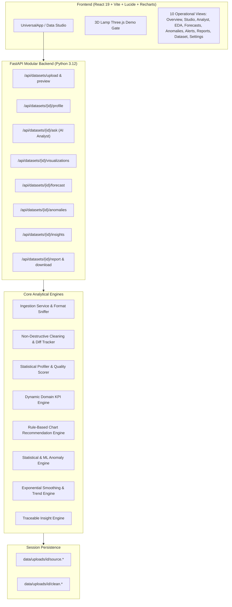

# InsightOps AI — Universal Live Data Intelligence Platform

**InsightOps AI** is an enterprise-grade, universal live data intelligence and automated decision platform. It transforms any structured CSV, XLSX, or XLS dataset into an interactive SaaS analytics workspace—automatically detecting schemas, cleaning data non-destructively, computing domain-tailored KPIs, generating responsive visualizations, isolating anomalies, projecting statistical forecasts, and serving a deterministic AI Analyst without requiring hard-coded column dependencies.

---

## Key Capabilities

1. **Universal Data Ingestion Studio**
   - Drag-and-drop & file browser with real-time file size and extension validation (CSV, XLSX, XLS up to 50 MB).
   - Automatic delimiter detection (comma, semicolon, tab, pipe) and character encoding detection (UTF-8, UTF-16, Latin-1, CP1252).
   - Multi-sheet selection preview for Excel workbooks.
   - PII masking on live preview samples before ingestion.
   - Sample dataset quick switcher (Sales, HR, E-commerce, Finance, Healthcare).

2. **Automatic Data Type & Semantic Classification**
   - Statistical profiling and column-name heuristics classify fields into **Numeric**, **Categorical**, **DateTime**, **Boolean**, **Text**, and **Identifier**.
   - Automatic domain classification: Finance, HR, E-commerce, Healthcare, Sales Operations, or Generic Tabular.

3. **Non-Destructive Cleaning Engine & Audit Trail**
   - Original upload is stored untouched on disk under `data/uploads/<dataset_id>/source.*`.
   - Normalizes whitespace, cleans currency symbols (`$`, `€`, `£`, `₹`), removes thousand separators, handles parenthesized negatives, and coerces dates.
   - Preserves an auditable cleaning log with before/after row counts, quality delta (`72% → 94%`), and a granular column-by-column `[View Changes]` diff.

4. **Automated Data Profiling & Health Scoring**
   - Computes completeness, validity, uniqueness, cardinality, quartiles (Q1, Q2, Q3), IQR, standard deviation, and outlier counts.
   - Weighted overall Data Quality score evaluating completeness, validity, and uniqueness.

5. **Dynamic KPI Engine**
   - Never relies on static assumptions.
   - Dynamically resolves domain metrics:
     - **Sales / Revenue**: Total Revenue, Profit, Average Order Value, Profit Margin.
     - **HR / Workforce**: Headcount, Average Salary, Attrition Rate, Average Tenure, Department Count.
     - **E-commerce**: Orders, Customers, Derived Revenue ($Price \times Quantity$), AOV, Conversion Rate.
     - **Finance**: Income, Operating Expenses, Net Cash Flow, Burn/Growth Rate.
     - **Healthcare**: Patient Count, Recovery Rate, Average Age, Treatment Count.
     - **Generic Fallback**: Record Count, Numeric Totals, Averages, Distributions.
   - Every metric reports `source_columns` and transparent mathematical calculation formulas.

6. **Automatic Visualization Engine**
   - Date + Numeric: Interactive Line & Area charts with trendlines.
   - Categorical + Numeric: Dynamic bar charts and horizontal ranking.
   - Category Proportions: Donut / Pie distribution charts.
   - Numeric + Numeric: Scatter plots with correlation coefficients.
   - Numeric Distribution: Dynamic histograms and box plots.
   - Correlation Matrix: Dynamic Pearson correlation grid across numeric features.

7. **Adaptive Dashboard Layouts**
   - Adapts UI hierarchy and widgets dynamically according to the ingested dataset's schema.
   - Zero hard-coded assumptions.

8. **Traceable Natural Language Insights**
   - Identifies highest/lowest categories, largest growth/decline, distribution skew, outlier presence, and data quality issues.
   - Every insight links to verifiable numerical evidence and column references.

9. **Multi-Model Anomaly Detection**
   - Statistical detection using IQR bounds, Z-score ($\pm 3\sigma$), rolling volatility, and optional Isolation Forest.
   - Interactive `[Investigate]` modal providing deviation percentages, observed vs. expected ranges, and severity badges (High, Medium, Low).

10. **Time-Series Forecasting**
    - Automatic temporal aggregation (Daily, Weekly, Monthly).
    - Statistical forecasting via Double Exponential Smoothing (Holt-Winters) and linear trend extrapolation with 95% confidence intervals.
    - Graceful fallback explanations when time-series data is absent.

11. **Deterministic AI Analyst**
    - Natural language question translation into verified mathematical computations.
    - Handles queries like: *"Why did sales decline?"*, *"What is the largest category?"*, *"Which region performs best?"*, *"Show unusual values"*, *"What is the average salary?"*, *"Forecast next month"*.
    - Returns structured answers, evidence cards, source column attribution, and formulas. No third-party LLM hallucination or external API calls required.

12. **Exploratory Data Analysis (EDA) Workspace**
    - Dedicated tabs for: **Overview**, **Distributions**, **Correlations**, **Relationships**, **Categories**, **Time Series**, and **Outliers**.

13. **Data Table Explorer**
    - Paginated grid with live client/server search, column-level sorting, null-value highlights, and outlier callouts.
    - PII-safe display masking sensitive email/phone columns.

14. **Universal Export Suite**
    - Cleaned CSV download.
    - Cleaned Excel (.xlsx) workbook download.
    - Full analysis JSON report export.
    - Formatted executive summary print / PDF stylesheet.

---

## Architecture Overview



---

## Getting Started

### Prerequisites
- Python 3.12+
- Node.js 20+ & npm
- Docker (optional)

### 1. Local Backend Setup
```bash
# Navigate to project root
cd /path/to/InsightOps-AI

# Create virtual environment
python3 -m venv .venv
source .venv/bin/activate  # On Windows: .venv\Scripts\activate

# Install dependencies
pip install -r backend/requirements.txt
pip install -r backend/requirements-dev.txt

# Start backend server
uvicorn backend.app.main:app --reload --port 8000
```
Backend API will be available at `http://localhost:8000` with interactive Swagger docs at `http://localhost:8000/docs`.

### 2. Local Frontend Setup
```bash
cd frontend
npm install
npm run dev
```
Open `http://localhost:5173`.
*Note: The demo login gate accepts any valid email and 8+ character password.*

### 3. Docker Deployment
```bash
docker compose up --build
```
- Frontend: `http://localhost:5173`
- Backend API: `http://localhost:8000`

---

## Running the Automated Test Suite

The test suite validates data ingestion, cleaning diffs, domain KPI detection across all sample datasets, chart recommendations, time-series forecasting, anomaly detection, AI Analyst queries, and error handling.

```bash
# Run full test suite (34 tests)
pytest
```

---

## Sample Datasets Included

Located in `data/sample/`:
- `sales.csv`: Multi-region retail revenue, profit, categories, and sales trends.
- `hr.csv`: Employee demographics, departments, salaries, tenure, and attrition.
- `ecommerce.csv`: Orders, customers, unit prices, quantities, countries, and order dates.
- `finance.csv`: Corporate revenues, expenses, cash flows, and operating margins.
- `healthcare.csv`: Clinical admissions, patient ages, treatments, costs, and recovery outcomes.
- `customer_operations.csv`: Leads, pipelines, conversion stages, and CRM interactions.

---

## API Reference

Comprehensive documentation is available in [docs/api.md](docs/api.md). Both path-parameter (`/api/datasets/{dataset_id}/*`) and query-parameter (`/api/dataset/*?dataset_id=...`) REST endpoints are fully supported.
