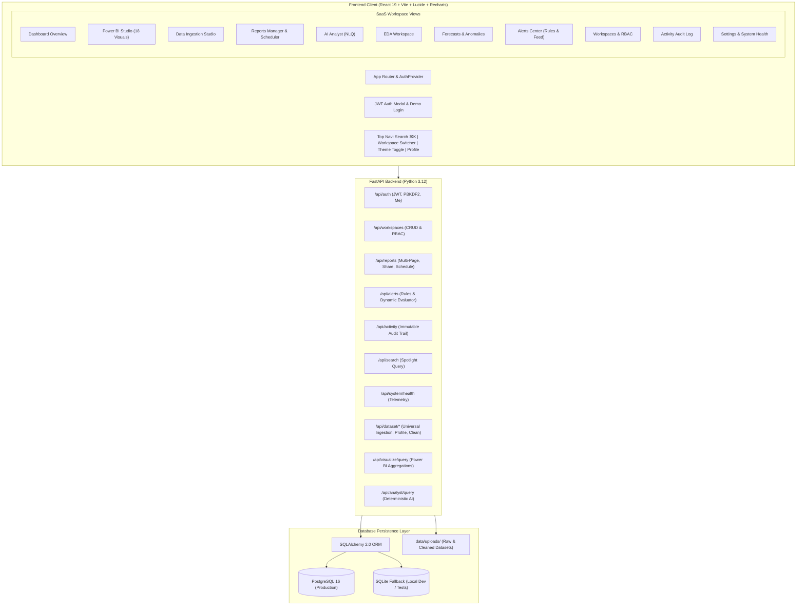

# InsightOps AI — Enterprise AI Business Intelligence SaaS Platform

**InsightOps AI** is a production-grade, enterprise-scale universal live data intelligence and automated decision platform. It transforms any structured CSV, XLSX, or XLS dataset into an interactive SaaS analytics workspace—automatically detecting schemas, cleaning data non-destructively, computing domain-tailored KPIs, generating responsive visualizations, isolating anomalies, projecting statistical forecasts, and serving a deterministic AI Analyst without requiring hard-coded column dependencies.

---

## Enterprise SaaS Architecture & Capabilities

### 1. Enterprise Authentication & Security
- **Production JWT Authentication**: RFC 7519 HS256 access tokens (60 min expiry) and refresh tokens (30 days) with token refresh rotation and secure session handling.
- **NIST Cryptography**: PBKDF2-HMAC-SHA256 password hashing with individual salt strings. Zero plain-text credential persistence.
- **Complete Auth Flow**: Sign Up, Login, Logout, Forgot Password, Reset Password with secure token expiration, and Remember Me persistence.
- **One-Click Demo Quick-Access**: Instant evaluation credentials for Administrator (`admin@insightops.ai` / `Password123!`) and Senior Analyst (`analyst@insightops.ai` / `Password123!`).

### 2. Multi-Workspace Architecture & RBAC
- **PostgreSQL & SQLite Database**: SQLAlchemy ORM models backing `User`, `Organization`, `Workspace`, `WorkspaceMember`, `DatasetRecord`, `Report`, `Dashboard`, `VisualItem`, `AlertRule`, and `ActivityLog`.
- **Automatic Database Engine Fallback**: Defaults out-of-the-box to SQLite (`sqlite:///./data/insightops.db`) for immediate local development and switches to PostgreSQL (`DATABASE_URL`) in production or Docker Compose.
- **Role-Based Access Control (RBAC)**: Fine-grained permissions across 4 tiers:
  - **Owner**: Full workspace authority, billing, deletion, and organization settings.
  - **Admin**: Member management, role assignment, dataset uploads, and system configurations.
  - **Analyst**: Report authoring, Power BI visual builder, dataset queries, and alert triggers.
  - **Viewer**: Read-only interactive dashboards, slicers, and exports.
- **Multi-Workspace Switcher**: Users belong to multiple workspaces with independent datasets, reports, and member rosters.

### 3. Power BI-Style Dynamic Visualization Engine
- **18 Interactive Visual Types**: Column, Bar, Stacked Bar, Line, Area, Combo (dual-axis), Pie, Donut (with KPI callout), Treemap (proportional rectangular tiles), Scatter, Bubble, Histogram, Box Plot (whiskers, quartiles, median, outliers), Heatmap Matrix (2D intensity grid), Funnel Chart (pipeline conversion), Gauge (speedometer progress to target), KPI Hero Cards (value, target, variance %, sparkline), and Data Matrix Tables (with in-cell data bars).
- **Power BI Drag-and-Drop Visual Builder**: Field wells for X-Axis, Y-Axis, Legend/Secondary Dimension, Tooltip, Aggregation selector (`Sum`, `Average`, `Count`, `Distinct Count`, `Min`, `Max`, `Median`, `Percentage of Total`), and Date Hierarchy (`Auto`, `Year`, `Quarter`, `Month`, `Day`).
- **Real-Time Cross-Filtering**: Clicking any chart element cross-filters all other dashboard visuals simultaneously with dimmed opacity highlighting.
- **Interactive Slicers**: Date range presets (All, 30D, 90D, YTD), category dropdowns, and numeric range controls.
- **Temporal Hierarchy Drill-Down**: Deep dive through Year $\rightarrow$ Quarter $\rightarrow$ Month $\rightarrow$ Day.

### 4. Production Reports Manager
- **Multi-Page Reports**: Create, edit, rename, duplicate, and delete report pages (`Executive Overview`, `Regional Breakdown`, `Deep Dive`, `+ Add Page`).
- **Public & Role-Based Sharing**: Toggle public access URLs with configurable permissions (`Viewer` vs `Editor`).
- **Automated Scheduling**: Configure Daily, Weekly, or Monthly executive deliveries with email recipient distribution.
- **Multi-Format Exports**: Individual visuals and report dashboards export to 2x high-res PNG, CSV, Excel (.xlsx), and print-ready PDF.

### 5. Intelligent Alerts Center & SLA Monitoring
- **Real-time Alert Rules Engine**: Create custom threshold, anomaly, and KPI change monitors (`>`, `<`, `>=`, `<=`, `==`) with severity tags (`Critical`, `Warning`, `Info`).
- **Live Evaluated Notifications Feed**: Dynamically evaluates the active dataset against all active monitoring rules and streams triggered notifications with value deviations and timestamps.
- **Notification Channels**: In-app feed, Email alerts, and webhook/Slack notifications.

### 6. Security Audit & Activity Trail
- **Immutable Audit Logging**: Records login events, dataset ingestions, report creation, edits, exports, and workspace permission changes with actor email, IP address, and timestamp.
- **JSON Metadata Inspector**: Expandable event viewer displaying exact payloads and execution parameters.
- **One-Click Audit CSV Export**: Instant compliance and security export for external auditing.

### 7. Universal Spotlight Search (`⌘K` / `Ctrl+K`)
- Global keyboard-accessible spotlight modal searching across Reports, Ingested Datasets, Workspaces, and Alert Rules.

### 8. Developer Telemetry & System Health
- Real-time diagnostic inspector pinging `/api/system/health`.
- Reports SQLAlchemy database dialect, live connection status, table row counts, uptime, and memory statistics.

### 9. Universal Data Ingestion & Profiling Studio
- Drag-and-drop ingestion supporting CSV, XLSX, XLS up to 50 MB.
- Automatic delimiter detection (comma, semicolon, tab, pipe) and character encoding detection.
- Non-destructive cleaning engine with transparent before/after diff reports (`[View Changes]`).
- Statistical profiling with null percentages, cardinality, quartiles, and IQR outlier counts.
- Dynamic KPI resolution tailored to Sales, HR, E-Commerce, Finance, Healthcare, or generic tabular datasets.

### 10. Verified AI Analyst
- Deterministic natural language question engine converting business queries into verified mathematical computations with 100% traceable source columns and formulas.

---

## System Architecture



---

## Quick Start Guide

### Option 1: Local Development (Instant SQLite Fallback)

1. **Clone and enter the workspace**:
   ```bash
   git clone <repo-url>
   cd InsightOps-AI
   ```

2. **Start the FastAPI Backend**:
   ```bash
   pip install -r backend/requirements.txt
   uvicorn backend.app.main:app --reload --port 8000
   ```
   *The database tables will automatically create and seed with default workspaces and the default administrator.*

3. **Start the Frontend**:
   ```bash
   cd frontend
   npm install
   npm run dev
   ```
   Visit `http://localhost:5173`.

4. **Sign In**:
   - Use the **1-Click Quick Demo Login** button for **Admin** (`admin@insightops.ai` / `Password123!`).
   - Or click **Analyst** (`analyst@insightops.ai` / `Password123!`).

---

### Option 2: Docker Compose (Full Stack with PostgreSQL)

```bash
docker compose up --build
```
This boots:
- `insightops-postgres` on port `5432`
- `insightops-api` on port `8000`
- `insightops-web` on port `5173`

---

## Running the Automated Test Suite

InsightOps AI includes a test suite covering the Universal Dataset Pipeline, Power BI Visual Query Engine, and SaaS Platform Architecture:

```bash
# Run the complete test suite
pytest -v

# Run SaaS platform specific tests
pytest tests/test_saas_platform.py -v

# Run Power BI visual engine tests
pytest tests/test_powerbi_visual_engine.py -v
```

All 50 tests pass with zero regressions.

---

## Default Seed Credentials

| Role | Email | Password | Permissions |
| :--- | :--- | :--- | :--- |
| **Administrator** | `admin@insightops.ai` | `Password123!` | Owner of Production Analytics & Sales Workspaces. Full access. |
| **Senior Analyst** | `analyst@insightops.ai` | `Password123!` | Analyst in default workspace. Report & Visual authoring. |
