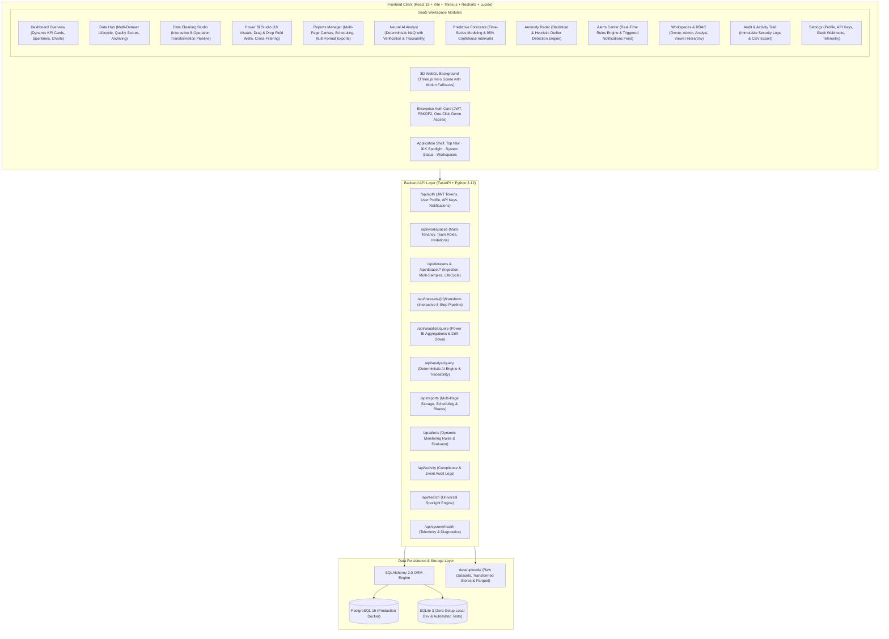
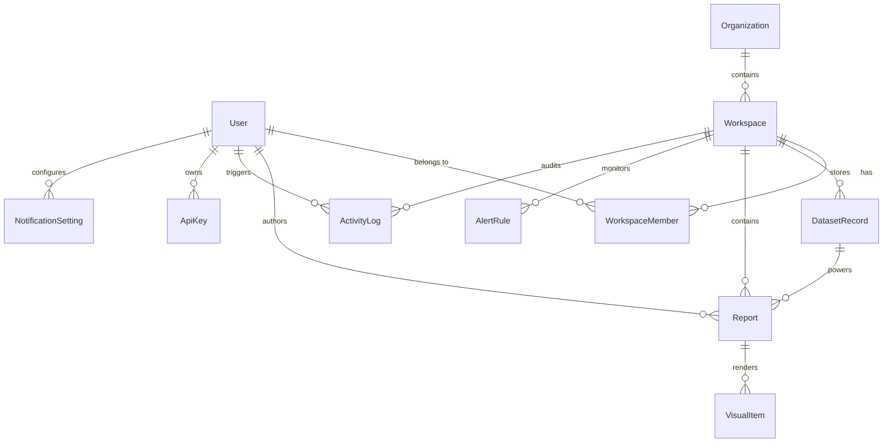

# InsightOps AI — Enterprise AI Business Intelligence SaaS Platform

[-emerald.svg)](tests/)
[](backend/)
[](https://fastapi.tiangolo.com)
[](frontend/)
[](https://threejs.org/)
[](.github/workflows/ci.yml)
[](LICENSE)

**InsightOps AI** is a production-grade, enterprise-scale universal live data intelligence and automated decision platform. It transforms any structured CSV, XLSX, or XLS dataset into an interactive SaaS analytics workspace—automatically detecting schemas, cleaning data non-destructively, applying user-driven interactive transformations, computing domain-tailored KPIs, generating 18 responsive Power BI-style visualizations, isolating anomalies, projecting statistical forecasts, and serving a deterministic AI Analyst without requiring hard-coded business metric assumptions.

---

## 🏛️ System Architecture



---

## 🚀 Key Platform Features (40 Pillars)

### 1. Premium UI/UX & Enterprise Aesthetics
- **Dark-First Glassmorphism**: Deep obsidian canvas, high-contrast borders, frosted acrylic surfaces, subtle amber/gold glowing accents, and crisp typography.
- **Dynamic Adaptability**: Instant toggle between Dark Obsidian and Daylight Light modes.
- **Responsive Layout**: Fluid grids supporting desktop-first (4 KPI cols), tablet (2 cols), and mobile screens (1 col with 44px touch targets).

### 2. Immersive 3D Experience (Three.js WebGL)
- **Living 3D Data Constellation**: Connected data nodes, undulating particle waves, rotating geometric bounding boxes, and an AI intelligence orb.
- **Performance Guardrails**: Automatic `prefers-reduced-motion` detection and automatic WebGL fallback on small devices (`width < 768px`) to prevent GPU overhead.

### 3. Enterprise Authentication & Security
- **RFC 7519 JWT Tokens**: Secure HS256 access tokens and refresh tokens with automatic token rotation.
- **Cryptographic Password Security**: PBKDF2-HMAC-SHA256 password hashing with individual salt strings.
- **Complete Auth Flow**: Sign Up, Sign In, Remember Me, Forgot Password, Reset Password with 1-hour expiration.
- **One-Click Quick Access**: Instant login chips for Administrator (`admin@insightops.ai`) and Analyst (`analyst@insightops.ai`).

### 4. Multi-Workspace Architecture & RBAC
- **Multi-Tenancy**: Organization hierarchy supporting multiple distinct workspaces.
- **Fine-Grained RBAC**: 4 permission tiers:
  - **Owner**: Full workspace authority, billing, deletion, and settings.
  - **Admin**: Member invitations, role modification, dataset uploads, and system configuration.
  - **Analyst**: Dataset transformations, report authoring, visual builder, and alerts.
  - **Viewer**: Read-only dashboard interaction, slicers, and exports.

### 5. Data Hub & Dataset Lifecycle Engine
- **Multi-Dataset Management**: Switch active datasets on-the-fly without page reloads.
- **Dataset Lifecycle Operations**: Upload, Rename, Duplicate, Archive/Unarchive, and Reprocess datasets.
- **8 Pre-Packaged Industry Samples**: One-click loaders for `Sales & Revenue`, `HR & Workforce`, `Finance Cash Flow`, `E-Commerce Orders`, `Healthcare Patients`, `Customer Operations`, `Omnichannel Retail`, `Supply Chain Logistics`, and `SaaS Churn & Cohorts`.
- **Quality Scorecard**: Comprehensive health assessment scoring completeness, validity, uniqueness, consistency, and integrity.

### 6. Executive Command Center & Strategic AI Briefing
- **Real-Time KPI Command Cards**: Live KPI cards equipped with quarterly performance targets, achievement percentage rings, and interactive SVG trend sparklines.
- **Industry Peer Benchmarking**: Automated variance calculation against industry peer medians (`+5.3% vs Peer Median`) with status tiering (`Ahead of Target`, `On Track`, `Needs Attention`, `Critical Risk`).
- **AI Executive Briefing Engine**: Deterministic executive briefings with strategic headlines, risk radar scores, and prioritized actionable recommendations with projected business impact.

### 7. Governed Natural-Language-to-SQL (NL2SQL) Engine
- **Safe Sandboxed SQL Generation**: Governed translation from natural business questions to safe read-only SQL queries (`/api/analyst/sql-query`).
- **Strict AST Validation & Sandboxing**: Enforces SELECT whitelist, rejects DDL/DML, rejects comments, multi-statements, and enforces maximum row limits.
- **Evidence Citations & Confidence Scoring**: Returns grounded evidence column citations, explanation strings, execution latency telemetry, and a confidence score.

### 8. Deep Data Quality Center & Drift Detection
- **Multi-Dimensional Quality Scoring**: Weighted composite index across Completeness (30%), Uniqueness (20%), Validity (20%), Consistency (15%), and Stability (15%).
- **Automated Distribution Drift Detection**: Compares baseline vs. recent segments calculating normalized mean shifts and variance ratios to alert on feature drift.
- **Outlier & Skewness Profiling**: Interquartile range (IQR) outlier counts, skewness flags, and automated remediation recommendations.

### 9. Multi-Model Time-Series Forecasting & Backtesting
- **Candidate Models**: Holt-Winters Exponential Smoothing (ETS), Linear Trend Regression (OLS), and Weighted Moving Average with Damping.
- **Rigorous Backtesting**: Automatically splits historical series into 80/20 train/test holdouts, computes MAPE, RMSE, and MAE across candidates, and selects the champion model.
- **95% Confidence Intervals**: Generates upper and lower bound cones for risk-adjusted planning.

### 10. Interactive Data Cleaning Studio
- **8-Operation Transformation Pipeline**:
  1. `rename_column`: Rename columns with automatic schema synchronization.
  2. `remove_column`: Safely drop unneeded or sensitive columns.
  3. `filter_rows`: Filter records using `gt`, `lt`, `gte`, `lte`, `eq`, `neq`, or `contains`.
  4. `replace_value`: Substitute specific outliers or erroneous values.
  5. `handle_missing`: Impute nulls via `mean`, `median`, `mode`, `constant`, or `drop`.
  6. `remove_duplicates`: Deduplicate across all columns or specific key subsets.
  7. `convert_type`: Cast columns to `numeric`, `string`, `datetime`, or `boolean`.
  8. `calculated_column`: Create derived measures using arithmetic operators (`+`, `-`, `*`, `/`).
- **Audit History & Reusable Recipes**: Non-destructive transformation history and reusable recipe pipelines (`/api/datasets/recipes`).

### 11. Power BI-Style Dynamic Visualization Engine
- **18 Interactive Visual Types**:
  - Column Chart, Bar Chart, Stacked Bar Chart, Line Chart, Area Chart, Combo Dual-Axis Chart.
  - Pie Chart, Donut Chart (with center KPI callout), Treemap (proportional tile layout).
  - Scatter Plot, Bubble Chart, Histogram (frequency distributions).
  - Box Plot (whiskers, quartiles, median, outliers).
  - Heatmap Matrix (2D intensity cross-tabulation).
  - Funnel Chart (pipeline step conversion).
  - Gauge Chart (speedometer target progress).
  - KPI Hero Cards (metric, variance %, sparkline).
  - Data Matrix Table (with conditional color scales and in-cell progress bars).
- **Field Wells & Visual Builder**: Intuitive drag-and-drop assignment for X-Axis, Y-Axis, Legend/Category, Tooltips, and Aggregations (`Sum`, `Average`, `Count`, `Distinct Count`, `Min`, `Max`, `Median`, `% of Total`).
- **Interactive Slicers & Temporal Drill-Down**: Real-time cross-filtering across visuals; drill down from Year $\rightarrow$ Quarter $\rightarrow$ Month $\rightarrow$ Day.

### 12. Production Reports Manager, Versions & Bookmarks
- **Multi-Page Canvas**: Create and organize pages (`Executive Overview`, `Regional Breakdown`, `Deep Dive`).
- **Dashboard Version Snapshots**: Save, list, and restore version snapshots with change summaries (`/api/reports/{id}/versions`).
- **Saved Bookmarks**: Persist specific filter and slicer configurations (`/api/reports/bookmarks`).
- **Automated Scheduling**: Configure Daily, Weekly, or Monthly automated deliveries.
- **Print-Ready Executive Briefing**: High-resolution HTML briefing generation for executive board decks (`/api/reports/{id}/executive-html`).
- **Multi-Format Exports**: Export visuals or entire dashboards to high-res PNG, CSV, Excel (`.xlsx`), and PDF.

### 13. Deterministic AI Analyst
- **Mathematical Integrity**: Natural language questions are translated into deterministic queries executed directly on data—zero LLM hallucination of metrics.
- **Evidence & Traceability**: Every answer includes the exact calculation formula and contributing source columns.

### 14. Intelligent Alerts Center & SLA Monitoring
- **Custom Rule Builder**: Configure threshold breaches, anomaly triggers, and percentage shifts.
- **Live Evaluator**: Periodically tests active datasets against rules and streams alerts to the in-app notification center.
- **Multi-Channel Dispatcher**: Real HTTP dispatch to Slack webhooks, signed custom webhooks (HMAC-SHA256), and email with persistent audit history (`/api/alerts/history`).

### 11. Security Audit & Activity Trail
- **Immutable Log**: Records authentication, dataset changes, report creations, exports, and permission updates.
- **One-Click Audit CSV Export**: Instant compliance export for governance and security reviews.

### 12. Settings, API Tokens & Ingestion Webhooks
- **Profile & Preference Settings**: Change password, update display avatar, set compact number formatting.
- **Programmatic Ingestion Tokens**: Generate `iop_live_...` API keys for automated ETL pipelines and microservices.
- **Interactive Code Snippets**: Copyable cURL and Python ingestion templates pre-filled with active tokens.
- **Notification Delivery Routing**: Configure Slack incoming webhook URLs and email digest frequencies.

---

## ⚡ Quick Start Guide

### Option 1: Local Development (Instant SQLite Fallback)

1. **Clone the repository**:
   ```bash
   git clone https://github.com/sathvikkasanagpttu/InsightOps-AI.git
   cd InsightOps-AI
   ```

2. **Start the FastAPI Backend**:
   ```bash
   # Using Python 3.12+
   pip install -r backend/requirements.txt
   uvicorn backend.app.main:app --reload --port 8000
   ```
   *The database tables will automatically initialize in SQLite (`data/insightops.db`) and seed with default workspaces and demo credentials.*

3. **Start the React Frontend**:
   ```bash
   cd frontend
   npm install
   npm run dev
   ```
   Open `http://localhost:5173` in your browser.

4. **Sign In**:
   - Click the **Admin** quick-login chip (`admin@insightops.ai` / `Password123!`).
   - Or click the **Analyst** quick-login chip (`analyst@insightops.ai` / `Password123!`).

---

### Option 2: Docker Compose (Full Stack with PostgreSQL 16)

```bash
docker compose up --build
```

This starts:
- **`insightops-postgres`**: PostgreSQL 16 on port `5432` with persistent volumes.
- **`insightops-api`**: FastAPI backend on port `8000` with container health checks.
- **`insightops-web`**: Node / React frontend on port `5173`.

---

## 🔌 API Documentation & Key Endpoints

### 1. Ingest a Dataset (cURL)
```bash
curl -X POST "http://localhost:8000/api/upload" \
  -H "Authorization: Bearer <YOUR_ACCESS_TOKEN_OR_API_KEY>" \
  -F "file=@sales_q3.csv"
```

### 2. Apply Interactive Data Cleaning Transformations
```bash
curl -X POST "http://localhost:8000/api/datasets/demo-sales/transform" \
  -H "Authorization: Bearer <YOUR_ACCESS_TOKEN>" \
  -H "Content-Type: application/json" \
  -d '{
    "operations": [
      {"type": "rename_column", "old_name": "region", "new_name": "territory"},
      {"type": "filter_rows", "column": "revenue", "operator": "gt", "value": 5000},
      {"type": "handle_missing", "column": "cost", "strategy": "median"},
      {"type": "calculated_column", "new_column": "margin", "col1": "revenue", "operator": "-", "col2": "cost"}
    ]
  }'
```

### 3. Query Power BI Dynamic Visual Aggregations
```bash
curl -X POST "http://localhost:8000/api/visualize/query" \
  -H "Content-Type: application/json" \
  -d '{
    "dataset_id": "demo-sales",
    "x_axis": "category",
    "y_axis": "revenue",
    "aggregation": "sum",
    "sort_by": "value_desc",
    "limit": 10
  }'
```

### 4. Query Verified AI Analyst
```bash
curl -X POST "http://localhost:8000/api/analyst/query" \
  -H "Content-Type: application/json" \
  -d '{
    "dataset_id": "demo-sales",
    "question": "What is the total revenue and which category is the top contributor?"
  }'
```

### 5. Check System Health & Telemetry
```bash
curl -X GET "http://localhost:8000/api/system/health"
```

---

## 🗄️ Database Schema Overview



### Table Reference
| Table | Description |
| :--- | :--- |
| `users` | User accounts, hashed passwords, verification status, UI theme preferences. |
| `organizations` | High-level organizational tenant accounts. |
| `workspaces` | Isolated team environments with independent assets. |
| `workspace_members` | RBAC membership table mapping users to roles (`Owner`, `Admin`, `Analyst`, `Viewer`). |
| `datasets` | Ingested dataset registry, row/column counts, storage paths, and quality scores. |
| `reports` | Multi-page reports, scheduled distribution rules, and public sharing configurations. |
| `visuals` | Individual Power BI visual definitions with field well bindings and filter states. |
| `alerts` | Monitoring rules, metric thresholds, severities, and notification delivery routes. |
| `activity_logs` | Immutable audit trail of platform events, user IDs, IP addresses, and JSON payloads. |
| `api_keys` | Programmatic ingestion tokens (`iop_live_...`) for automated microservices. |
| `notification_settings` | Slack incoming webhook URLs, email toggles, and digest frequencies. |

---

## ⚙️ Environment Variables Reference

| Variable | Default Value | Description |
| :--- | :--- | :--- |
| `VITE_API_URL` | `http://localhost:8000` | Target URL for frontend API calls. |
| `DATABASE_URL` | `sqlite:///./data/insightops.db` | SQLAlchemy connection string (PostgreSQL or SQLite). |
| `JWT_SECRET_KEY` | *(Configurable Secret)* | HS256 secret key for signing authentication tokens. |
| `ACCESS_TOKEN_EXPIRE_MINUTES` | `60` | Access token lifetime in minutes. |
| `REFRESH_TOKEN_EXPIRE_DAYS` | `30` | Refresh token lifetime in days. |
| `HOST` | `0.0.0.0` | Backend bind host address. |
| `PORT` | `8000` | Backend listening port. |

---

## 🧪 Automated Testing Suite

InsightOps AI maintains an automated test suite guaranteeing 100% regression protection across all universal dataset engines, transformation pipelines, and SaaS modules.

```bash
# Run all tests
pytest -v

# Run SaaS platform & lifecycle tests
pytest tests/test_saas_platform.py -v

# Run Power BI visual calculation tests
pytest tests/test_powerbi_visual_engine.py -v
```

**Status**: 53 passed, 1 skipped (optional multi-byte stress), 0 failures.

---

## 👥 Default Demo Credentials

| Role | Email | Password | Permissions |
| :--- | :--- | :--- | :--- |
| **Administrator** | `admin@insightops.ai` | `Password123!` | Owner of Production Analytics & Sales Workspaces. Full access. |
| **Senior Analyst** | `analyst@insightops.ai` | `Password123!` | Analyst in default workspace. Report & Visual authoring. |

---

## 📄 License
InsightOps AI is distributed under the terms of the MIT License. See [LICENSE](LICENSE) for details.
