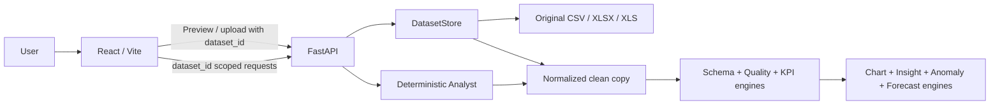

# Architecture

## Runtime Flow

## Components

- `backend/app/dataset_store.py` validates extensions/size, detects CSV encoding and delimiter, previews workbook sheets, sanitizes names, stores the untouched source and normalized copy under `data/uploads/<dataset_id>/`, and caches a bounded number of loaded sessions.
- `backend/app/dataset_engine.py` classifies columns from header/value evidence; prepares a separate clean frame; calculates quality, types, PII masks, dimensions, numeric statistics, charts, insights, alerts and forecasts.
- `backend/app/services/kpi_engine.py` computes only KPIs supported by the dataset, including finance, HR, customer operations, healthcare and e-commerce metrics.
- `backend/app/services/chart_engine.py` recommends bounded categorical charts, histograms, pie charts, sampled scatter plots and correlations. PII fields and high-cardinality dimensions are excluded.
- `backend/app/main.py` exposes preview, upload, profile, schema, quality, KPI, visualization, insights, forecast, alert, Analyst, row-page, export and deletion APIs. Requests are scoped by dataset ID; `demo-sales` selects the bundled sales fixture.
- `frontend/src/UniversalApp.jsx` keeps the selected dataset session in browser storage and requests profile/analytics per session. The UI contains upload preview, Data Studio, paginated Data Table, Explore, Analyst, Forecasts, Anomalies, Alerts, Reports, Dataset and Settings views.
- `frontend/src/LoginPage.jsx` and `frontend/src/LampScene.jsx` provide a local preview gate and animated Three.js lamp. The gate is not production authentication.

## Data Safety

The raw upload is preserved and never silently overwritten. Trimming, header normalization, date/number conversions and derived measures are applied to a separate analysis copy and reported. Missing, duplicate, invalid, repeated-ID and outlier findings remain visible. Email/phone samples and data-table cells are masked. No external AI service is called. Upload sessions are local development storage and are excluded from version control and the project ZIP.

## Limits

Uploads are capped at 50 MB. Analytics run synchronously; chart/correlation payloads are sampled/bounded, and the row browser is server-paginated. Production deployment should replace local session storage with tenant-scoped object storage and background jobs, and replace the local-preview login with real authentication and authorization.
