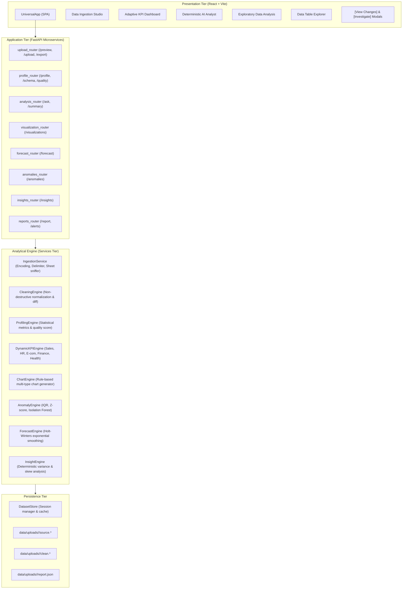

# InsightOps AI — Architecture & Technical Design

## 1. System Philosophy

InsightOps AI operates on four fundamental engineering invariants:
1. **Dynamic Schema-Agnostic Intelligence**: The platform never relies on static column names or pre-baked dashboards. All schemas, semantic roles, data types, KPIs, chart selections, and analytical queries are derived at runtime from the uploaded dataset.
2. **Deterministic, Traceable Computations**: No hallucinations. Every single KPI, anomaly, chart, and AI Analyst answer is grounded in verifiable mathematical operations with source column lineage and explicit formulas.
3. **Non-Destructive Ingestion**: The raw uploaded file is preserved unaltered under `data/uploads/<dataset_id>/source.*`. All cleaning actions (whitespace trimming, date standardization, currency normalization) are performed on an isolated working copy and documented in a granular before/after diff audit trail.
4. **Resilient Local & Production Operation**: Works out-of-the-box locally with disk-backed sessions, while remaining modular and containerized for multi-tenant cloud deployments.

---

## 2. Architecture Diagram

---

## 3. Core Engine Pipeline

When a user submits a dataset via the Ingestion Studio, the pipeline executes sequentially:

### Step 1: Ingestion & Format Sniffing (`services/ingestion.py`)
- Detects encoding (UTF-8, Latin-1, CP1252) and delimiter (`,`, `;`, `\t`, `|`).
- For Excel workbooks, lists available sheets and streams selected sheet into Pandas.
- Emits masked preview samples for sensitive data before committing session.

### Step 2: Non-Destructive Cleaning (`services/cleaning.py`)
- Sanitizes column names and trims whitespace.
- Coerces currency strings (`$`, `€`, `£`, `₹`), removes commas, and resolves parenthesized negative numbers `(100)` -> `-100`.
- Standardizes ISO date formats.
- Identifies duplicate rows, empty columns, and constant columns.
- Generates a granular column-by-column `cleaning_diff` tracking modified values, trimmed spaces, and coerced types.

### Step 3: Statistical Profiling (`services/profiling.py`)
- Classifies columns into 6 semantic types: `numeric`, `categorical`, `datetime`, `boolean`, `text`, and `id`.
- Computes completeness, uniqueness, mean, median, standard deviation, quartiles (Q1, Q2, Q3), and IQR.
- Calculates an overall Data Quality score (0–100) based on completeness, uniqueness, and format validity.

### Step 4: Domain Classification & KPI Synthesis (`services/kpi_engine.py`)
- Evaluates column token overlaps against 5 business domains: **Sales**, **HR**, **E-commerce**, **Finance**, and **Healthcare**.
- Automatically synthesizes domain-appropriate primary KPIs (e.g. Total Revenue, Attrition Rate, Derived AOV, Recovery Rate) with transparent formulas.
- Falls back to robust general-purpose statistical measures if no domain strongly matches.

### Step 5: Visualizations & Correlations (`services/chart_engine.py`)
- Temporal columns paired with numeric metrics yield Line and Area trends.
- Categorical columns paired with numeric metrics yield Bar charts and Horizontal Rankings.
- Proportional categories yield Donut and Pie charts.
- Continuous numerical variables yield sampled Scatter Plots, Histograms, and a full Pearson Correlation Matrix.

### Step 6: Anomaly Detection & Forecasting (`services/anomaly_engine.py`, `services/forecast_engine.py`)
- Employs IQR fences ($1.5 \times \text{IQR}$), Z-scores ($\pm 3\sigma$), rolling deviations, and Isolation Forest.
- Time-series aggregation provides 3-period forward projections with 95% confidence intervals using Double Exponential Smoothing (Holt's Linear).

### Step 7: Deterministic AI Analyst (`dataset_engine.py`)
- Tokenizes natural language questions into intent patterns: trend analysis, rankings, correlations, anomalies, forecasts, summary, or column statistics.
- Executes verified aggregation logic against the cleaned dataset and returns the answer alongside supporting evidence cards, source column references, and formula syntax.
