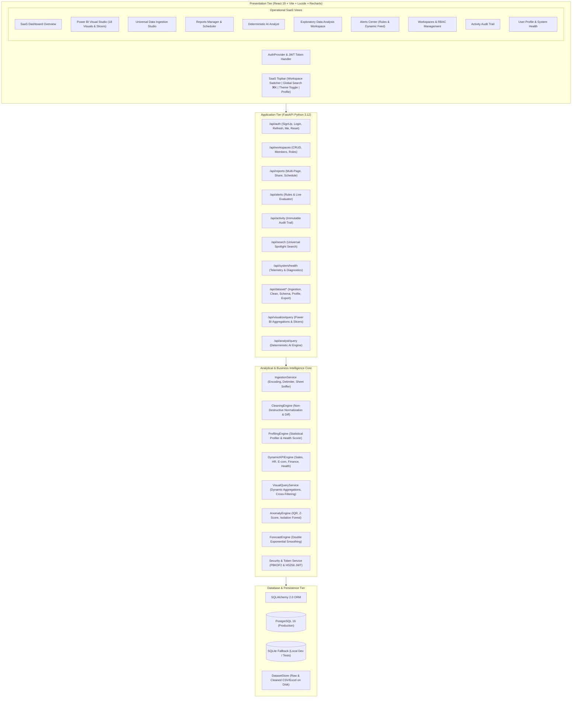

# InsightOps AI — Architecture & Technical Design

## 1. System Philosophy

InsightOps AI operates on four fundamental engineering invariants:
1. **Dynamic Schema-Agnostic Intelligence**: The platform never relies on static column names or pre-baked dashboards. All schemas, semantic roles, data types, KPIs, chart selections, and analytical queries are derived at runtime from the uploaded dataset.
2. **Deterministic, Traceable Computations**: No hallucinations. Every single KPI, anomaly, chart, and AI Analyst answer is grounded in verifiable mathematical operations with source column lineage and explicit formulas.
3. **Enterprise SaaS Security & Multi-Tenancy**: Built on RFC 7519 HS256 JWT authentication, NIST PBKDF2 password hashing, and granular Role-Based Access Control (RBAC) across isolated team workspaces.
4. **Resilient Local & Production Operation**: Works out-of-the-box locally with SQLite and disk-backed sessions, while seamlessly scaling to PostgreSQL and containerized cloud environments with Docker Compose.

---

## 2. Architecture Diagram

---

## 3. Database Schema Design (SQLAlchemy ORM)

| Table | Primary Key | Key Attributes | Purpose |
| :--- | :--- | :--- | :--- |
| `users` | `id` (UUID) | `email`, `hashed_password`, `full_name`, `avatar_url`, `is_active`, `theme_preference` | User credentials and profile settings |
| `organizations` | `id` (UUID) | `name`, `slug`, `owner_id` | Enterprise multi-tenancy parent boundary |
| `workspaces` | `id` (String/UUID) | `organization_id`, `owner_id`, `name`, `description` | Isolated analytical environment |
| `workspace_members` | `id` (UUID) | `workspace_id`, `user_id`, `role` (`Owner`, `Admin`, `Analyst`, `Viewer`) | Role-based access control binding |
| `datasets` | `id` (String) | `workspace_id`, `name`, `filename`, `row_count`, `quality_score`, `storage_path` | Ingested universal datasets |
| `reports` | `id` (UUID) | `workspace_id`, `title`, `description`, `pages` (JSON), `is_shared`, `schedule_frequency` | Multi-page reports with visuals and scheduling |
| `dashboards` | `id` (UUID) | `workspace_id`, `report_id`, `name`, `layout` (JSON) | Live dashboard layouts |
| `visual_items` | `id` (UUID) | `dashboard_id`, `title`, `visual_type`, `config` (JSON) | Individual Power BI visual definitions |
| `alert_rules` | `id` (UUID) | `workspace_id`, `name`, `metric`, `condition_operator`, `threshold_value`, `severity`, `is_active` | Real-time threshold monitoring rules |
| `activity_logs` | `id` (UUID) | `workspace_id`, `user_id`, `user_email`, `action`, `resource`, `ip_address`, `details` (JSON) | Immutable security audit trail |

---

## 4. Power BI Visual Engine Architecture

The visual engine processes aggregated queries dynamically via `/api/visualize/query`:
- **Dimensions & X-Axis**: Grouping by categorical fields or date hierarchy (`Year`, `Quarter`, `Month`, `Day`).
- **Measures & Y-Axis**: Aggregated via `sum`, `avg`, `count`, `distinct_count`, `min`, `max`, `median`, or `pct`.
- **Secondary Dimensions / Legend**: Produces stacked bar or multi-series clustered aggregations.
- **Cross-Filtering**: Filters are applied dynamically to the DataFrame, re-aggregating remaining fields and generating dimmed visual cues for unselected slices.
- **Auto Recommender**: Selects the optimal chart type (Column, Bar, Line, Area, Pie, Donut, Scatter, Box Plot, Heatmap, Funnel, Gauge, KPI Card) based on field cardinality and semantic types.
